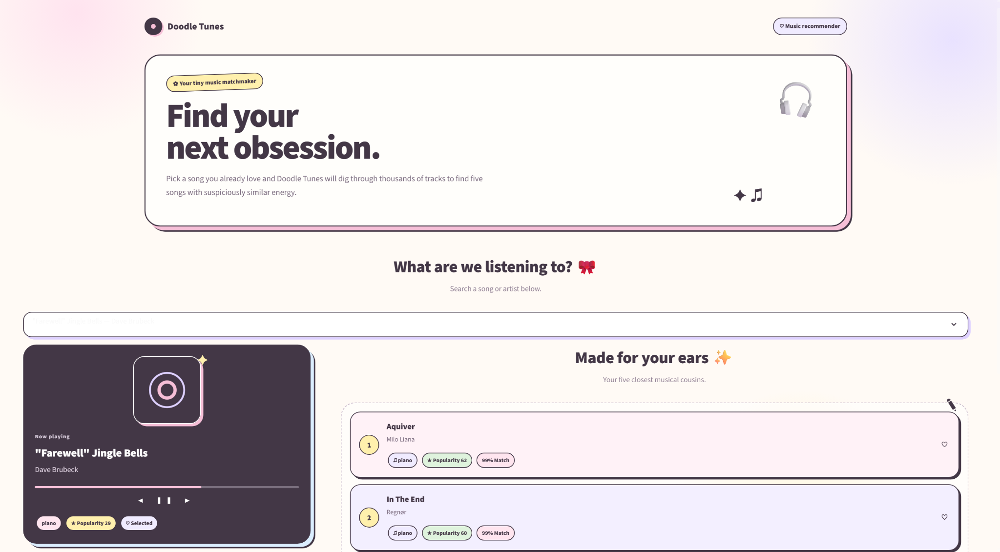
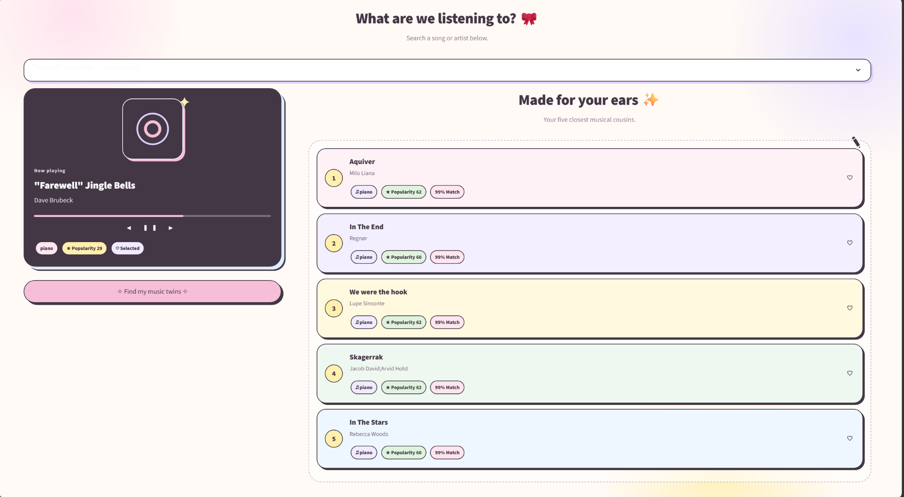

# Doodle Tunes 🎧

A cute, interactive music recommendation system built with Python, Scikit-learn, and Streamlit.

Doodle Tunes recommends songs based on Spotify audio features using a content-based recommendation approach with cosine similarity.

---

## App Preview

### Home



### Recommendations



---

## Project Overview

The goal of this project is to build a simple but interactive music recommendation system that suggests songs with similar musical characteristics.

Users can select a song from the app and receive five recommendations based on:

- Danceability
- Energy
- Loudness
- Speechiness
- Acousticness
- Instrumentalness
- Liveness
- Valence
- Tempo
- Genre
- Popularity

The recommendation engine compares songs using standardized audio features and cosine similarity.

A small popularity weight is also added to the final ranking so the recommendations remain musically similar while still favoring more recognizable tracks.

---

## Dataset

The project uses a Spotify tracks dataset containing approximately **114,000 songs** across many genres.

After cleaning and removing duplicate song-artist combinations, the final dataset contains approximately **81,000 unique tracks**.

The dataset includes:

- Track name
- Artist
- Album
- Popularity
- Duration
- Explicit status
- Danceability
- Energy
- Key
- Loudness
- Mode
- Speechiness
- Acousticness
- Instrumentalness
- Liveness
- Valence
- Tempo
- Time signature
- Genre

---

## How the Recommendation System Works

### 1. Data cleaning

The dataset is cleaned by:

- removing missing song and artist names
- removing fully duplicated rows
- removing duplicate song-artist combinations
- resetting the dataframe index

### 2. Feature selection

The recommender uses the following audio features:

```text
danceability
energy
loudness
speechiness
acousticness
instrumentalness
liveness
valence
tempo
```

### 3. Feature scaling

The audio features are standardized using:

```python
StandardScaler
```

This ensures that features with larger numerical ranges, such as tempo and loudness, do not dominate the similarity calculation.

### 4. Cosine similarity

For the selected song, cosine similarity is calculated against all songs in the dataset.

Songs are then filtered to the same genre to improve recommendation relevance.

### 5. Final ranking

The final recommendation score is calculated using:

```text
85% audio-feature similarity
15% popularity
```

This keeps recommendations focused on musical similarity while adding a small popularity boost.

---

## Example

If a user selects:

```text
Blinding Lights — The Weeknd
```

the recommender returns songs with similar audio characteristics and genre profiles.

Each recommendation displays:

- Song title
- Artist
- Genre
- Popularity
- Similarity percentage

---

## Streamlit App

The recommendation system is wrapped in a custom Streamlit interface called **Doodle Tunes**.

The app includes:

- searchable song selection
- Spotify-inspired now-playing card
- pastel recommendation cards
- song genre and popularity tags
- similarity scores
- custom CSS styling
- hand-drawn doodle-style SVG decorations
- responsive layout

---

## Project Structure

```text
music-recommender/
│
├── data/
│   ├── spotify-tracks-dataset-detailed.csv
│   └── spotify_tracks_clean.csv
│
├── notebooks/
│   └── music_recommender.ipynb
│
├── images/
│   ├── doodle_tunes_home.png
│   └── doodle_tunes_recommendations.png
│
├── app.py
├── README.md
├── requirements.txt
└── .gitignore
```

---

## How to Run

1. Clone the repository.

2. Create a Python virtual environment:

```bash
python -m venv .venv
```

3. Activate the environment.

### Windows PowerShell

```powershell
.\.venv\Scripts\Activate.ps1
```

### macOS / Linux

```bash
source .venv/bin/activate
```

4. Install the required packages:

```bash
pip install -r requirements.txt
```

5. Run the Streamlit app:

```bash
streamlit run app.py
```

6. Open the local Streamlit URL in your browser.

---

## Technologies Used

- Python
- Pandas
- NumPy
- Scikit-learn
- Streamlit
- Jupyter Notebook
- HTML
- CSS
- SVG

---

## Machine Learning Concepts Used

- Content-based recommendation
- Feature engineering
- Feature scaling
- Cosine similarity
- Similarity ranking
- Weighted scoring

---

## Skills Demonstrated

- Data cleaning
- Exploratory data preparation
- Feature selection
- Feature scaling
- Recommendation systems
- Machine learning
- Model logic design
- Streamlit app development
- UI customization
- CSS styling
- Git and GitHub

---

## Future Improvements

Possible future improvements include:

- allowing users to select multiple favorite songs
- using artist and genre embeddings
- adding album artwork
- integrating the Spotify API
- adding song previews
- saving favorite recommendations
- adding collaborative filtering
- deploying the app online

---

## Author

Amal Iman